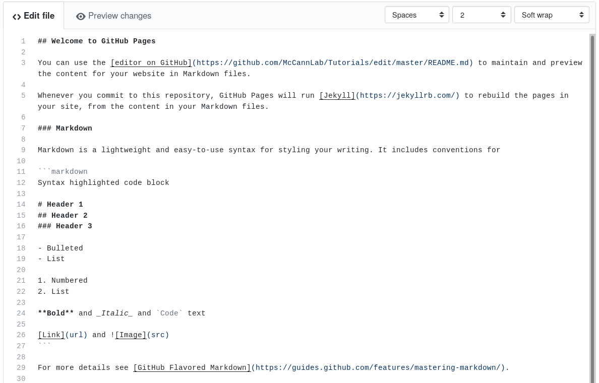

```{r setup, echo = FALSE}
knitr::opts_chunk$set(
  comment = "#>>",
  collapse = TRUE,
  warning = FALSE,
  message = FALSE,
  fig.width = 7,
  fig.height = 5.25,
  fig.align = 'center',
  width = 120
)
mypar <- list(fg = "#303940", bg = "transparent", las = 1)
```


<br><br>

.maintitle[Markdown ]

<br><br>

.pull-left[
##### <i class="fa fa-github" aria-hidden="true"></i> [McCannLab/Tutorials](https://github.com/McCannLab/Tutorials)
##### <i class="fa fa-calendar" aria-hidden="true"></i> April 2nd, 2019
##### <i class="fa fa-user" aria-hidden="true"></i>  [Kevin Cazelles](https://kevcaz.github.io/)
]
.pull-right[
<br>
<br>
<br>
.right[
  
  ]
]


---
class: inverse, center, middle

# What is it?


---
# Markdown
<br>


> Markdown is a lightweight markup language with plain text formatting syntax. [Wikipedia](https://en.wikipedia.org/wiki/Markdown)

--

#### Markup langage?

--

```html
This guy is <tag_bold>relentless<tag_bold>
```

```latex
This guy is \textbf{relentless}
```


---
# Markdown
<br>

### John Gruber - 2004 [<i class="fa fa-external-link" aria-hidden="true"></i>](https://daringfireball.net/projects/markdown/)

--

### Markdown <i class="fa fa-hand-o-right" aria-hidden="true"></i> HTML

--

### Mark~~up~~down 


---
# Markdown

> Markdown is intended to be as easy-to-read and easy-to-write as is feasible. [Wikipedia](https://en.wikipedia.org/wiki/Markdown)


### `html`

```html
<a href="https://github.com/KevCaz/aboutRMarkdown">My repo</a>
```

### `markdown`

```markdown
[My repo](https://github.com/KevCaz/aboutRMarkdown)
```


---
# Markdown

### `html`

```html
<ol>
  <li> items1 </li>
  <li> items2 </li>
  <li> items3 </li>
</ol>
```

### `markdown`

```markdown
1. items1
2. items2
3. items3
```


---
# Markdown *et al.*
<br>


- [GitHub Flavored Markdown (GFM)](https://help.github.com/articles/github-flavored-markdown/)
- [Pandoc Markdown](https://pandoc.org/MANUAL.html#pandocs-markdown)
- [Kramdown](http://kramdown.gettalong.org/syntax.HTML#math-blocks)
- [Markdown Extra](https://michelf.ca/projects/php-markdown/extra/)
- [MultiMarkdow](https://github.com/fletcher/MultiMarkdown/wiki/MultiMarkdown-Syntax-Guide#math-support)

<br>
--
- [CommonMark](http://commonmark.org/): a specification + a tutorial!

> "A strongly defined, highly compatible specification of Markdown."


---
class: inverse, center, middle

# What for?


---
# Markdown is everywhere
<br>

- [A couple of thoughts here](https://insileco.github.io/2018/05/13/markdown-everywhere/)
-  <i class="fa fa-arrow-right" aria-hidden="true"></i> <i class="fa fa-refresh" aria-hidden="true"></i> <i class="fa fa-arrow-right" aria-hidden="true"></i> `.html` / `.docx` / `.pdf`

--

- [Modern Scientific Authoring](http://swcarpentry.github.io/modern-scientific-authoring/)
- Your repos' Readme in GitHub
- [markdown-here](https://markdown-here.com/)
- [Rmarkdown](https://rmarkdown.rstudio.com/)

---
# Github



---
# markdown-here
<br>

## <i class="fa fa-video-camera" aria-hidden="true"></i> Live example


---
# Rmarkdown

<video width="100%" controls>
 <source src="img/RStudio1.webm" type="video/webm">
 Your browser does not support the video tag.
</video>


---
# Rmarkdown

<video width="100%" controls>
 <source src="img/RStudio3.webm" type="video/webm">
 Your browser does not support the video tag.
</video>


---
# Websites
<br>

#### Most frameworks integrate Markdown for content edition


---
# McCann Lab's Website

--

- **Github** : code sharing / tutorials
- **Slack**: direct chat
- **Twitter**: to promote our work
- **Current website**: https://www.mccannlab.org/

<br>

--

- https://mccannlab.github.io/
  - clone content of the former website
  - have a section 'lab meeting'
  - a shared agenda
  - ...
