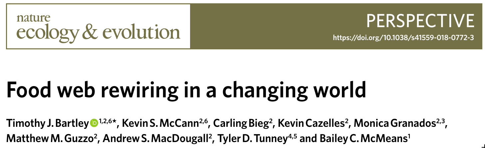
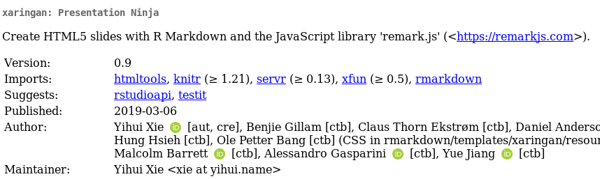

```{r setup, echo = FALSE}
knitr::opts_chunk$set(
  comment = "#>>",
  collapse = TRUE,
  warning = FALSE,
  message = FALSE,
  fig.width = 7,
  fig.height = 5.25,
  fig.align = 'center',
  width = 120
)
mypar <- list(fg = "#303940", bg = "transparent", las = 1)
```


<br><br>

.maintitle[<i class="fa fa-angle-double-right" aria-hidden="true"></i> About ORCID <i class="ai ai-orcid" aria-hidden="true"></i>]

<br><br>

.pull-left[
##### <i class="fa fa-github" aria-hidden="true"></i> [McCannLab/Tutorials](https://github.com/McCannLab/Tutorials)
##### <i class="fa fa-calendar" aria-hidden="true"></i> April 2nd, 2019
##### <i class="fa fa-user" aria-hidden="true"></i>  [Kevin Cazelles](https://kevcaz.github.io/)
]
.pull-right[
<br>
<br>
<br>
.right[
  
  ]
]


---
class: inverse, center, middle

# What is it?


---
# Open Researcher and Contributor ID
<br>


> The ORCID iD (Open Researcher and Contributor ID) is a nonproprietary
alphanumeric code to uniquely identify scientific and other academic authors
and contributors. [Wikipedia](https://en.wikipedia.org/wiki/ORCID)

--

<br>

- <i class="ai ai-orcid" aria-hidden="true"></i> 0000-0002-5898-0588 Timothy Bartley
- <i class="ai ai-orcid" aria-hidden="true"></i> 0000-0001-6619-9874 Kevin Cazelles
- <i class="ai ai-orcid" aria-hidden="true"></i> 0000-0001-9229-4410 Matthew M. Guzzo

---
# DOI and ORCID
<br>

## <i class="ai ai-doi ai" aria-hidden="true"></i> [Digital object identifier](https://en.wikipedia.org/wiki/Digital_object_identifier) <i class="fa fa-hand-o-right" aria-hidden="true"></i> <i class="fa fa-newspaper-o" aria-hidden="true"></i>

--

<br>

## <i class="ai ai-orcid" aria-hidden="true"></i> ORCID <i class="fa fa-hand-o-right" aria-hidden="true"></i>  <i class="fa fa-user-circle-o" aria-hidden="true"></i>


---
# Open Researcher and Contributor ID
<br>





---
# Open Researcher and Contributor ID
<br>





---
class: inverse, center, middle

# What for?


---
# A professional web page
<br>


### https://orcid.org/ + <i class="ai ai-orcid" aria-hidden="true"></i>

<br>

--

### https://orcid.org/0000-0001-6619-9874


---
# Make your life easier

## Create accounts

### https://mc.manuscriptcentral.com/oikos

<br>

## Keep your profile updated &nbsp;&nbsp;<i class="fa fa-file-text-o" aria-hidden="true"></i> <i class="fa fa-refresh" aria-hidden="true"></i> <i class="ai ai-orcid" aria-hidden="true"></i>


---
class: inverse, center, middle

# Extra

## [R package `rorcid`](https://github.com/ropensci/rorcid)
